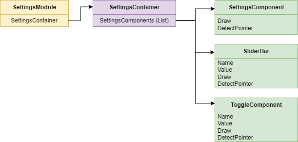
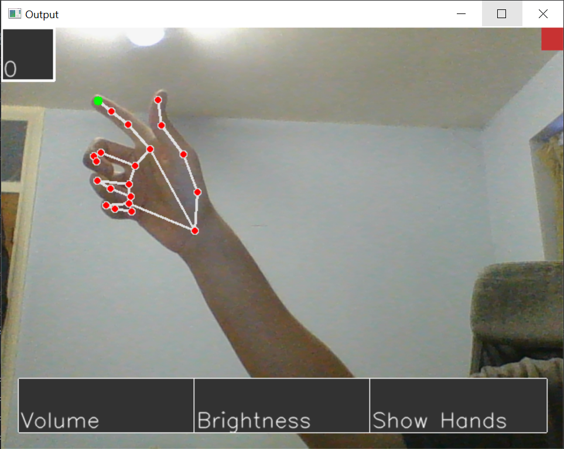
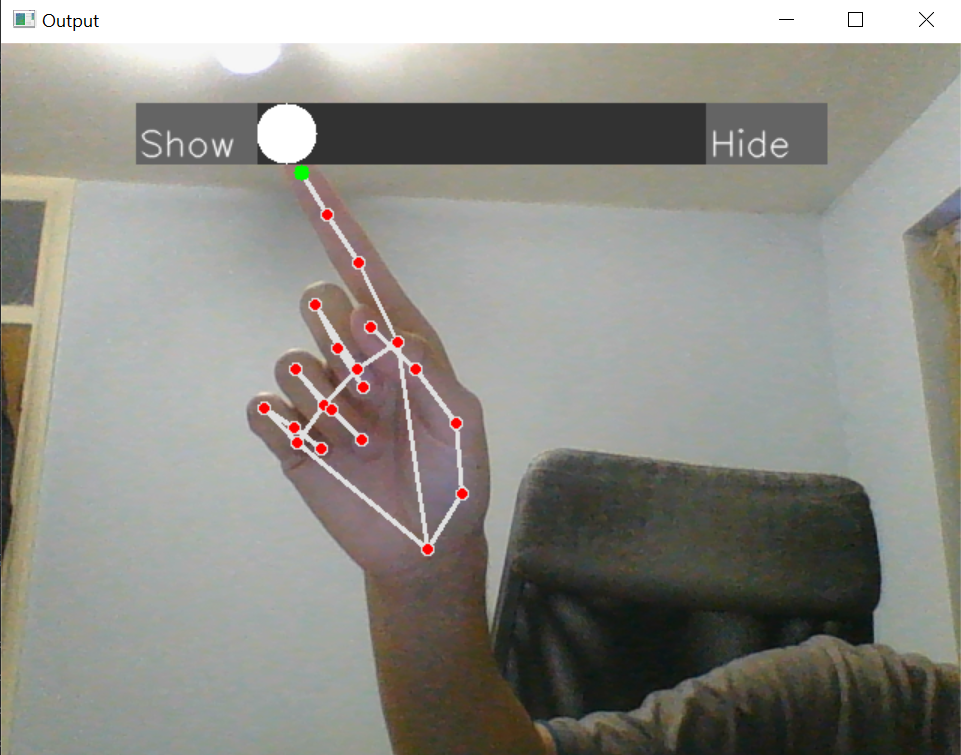
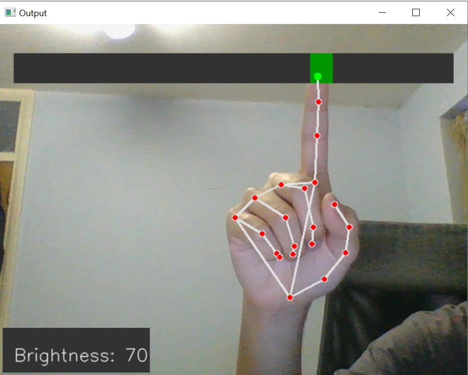

# WebcamSettingsModule

 The webcam settings module is a tool created for developers to set up various settings components like volume or brightness. These components are displayed on the screen for users to adjust. This is especially useful in situations where the user doesn't have an interface for changing controls (like in a Raspberry Pi project with no peripherals) but does have a camera available. 

 

<h1> Usage </h1>
<h2> General </h2>

The user can navigate through the menu using their index tip as a pointer, as well as through gesture recognition for some parts of the menu. The pointer is indicated by the green-circle at the tip of the index finger.

 

<ol>
 <li> 
  <h2> Main Menu </h2>
  
 When the webcam recognition function is activated, the user will be presented with the default menu screen. The available submenus are in the top-left of the screen, the settings component are at the bottom and the exit button is in the top-right.
 
 </li>

  <li> 
   <h2> Submenu Navigation </h2>
   
 Users can navigate through the submenus by pointing at the top-left of the screen. Submenus consist of different groups of components. Depending on the number of settings, the program may only have one submenu and hence submenu navigation may not be required. 

 </li>
 
  <li> 
   <h2> Adjusting Settings </h2>
   
 The user can then adjust the settings depending upon the particular component. For slider-bars, users can drag or point to the desired value level while in toggle components, users can simply point to the location of the desired value. Once the user is satisfied with the change, they must use a thumbs-up gesture to return to the submenu.
  
 
 

 </li>
 
  <li>
   <h2> Exiting the Settings </h2>
   
 To exit the settings, the user simply has to point to the top-left of the screen. To stop the web-camera for running, the user will have to press Q

 </li>
  
</ol>
 

<h1> Developer Usage </h1>
<ol>
 <li>
  <h2> Instantiate a Settings Container</h2>
  
 A SettingsContainer object must first be instantiated to create an object that will hold all our components and form the settings menu. It does not take any parameters by default.

    
  > settings_container = sc.SettingsContainer()
 </li>
 
  <li>
  <h2> Instantiate the components</h2>
  
 One must first instantiate a set of components - slider bars and toggle bars in this case - and then add them to SettingsContainer. In this scenario, we create two slider bar components (Volume with a default value of 50, and Brightness with a default value of 20) and a toggle bar component (Show Hands with labels Show and Hide, and a default value of True) before adding them to the SettingsContainer.

    
  > volume = sb.SliderBar("Volume", 50)
  > brightness = sb.SliderBar("Brightness", 20)
  > show_hands = tc.ToggleComponent("Show Hands", "Show", "Hide", True)
  > settings_container.add_component(volume)
  > settings_container.add_component(brightness)
  > settings_container.add_component(show_hands) </li>
 </ol>

